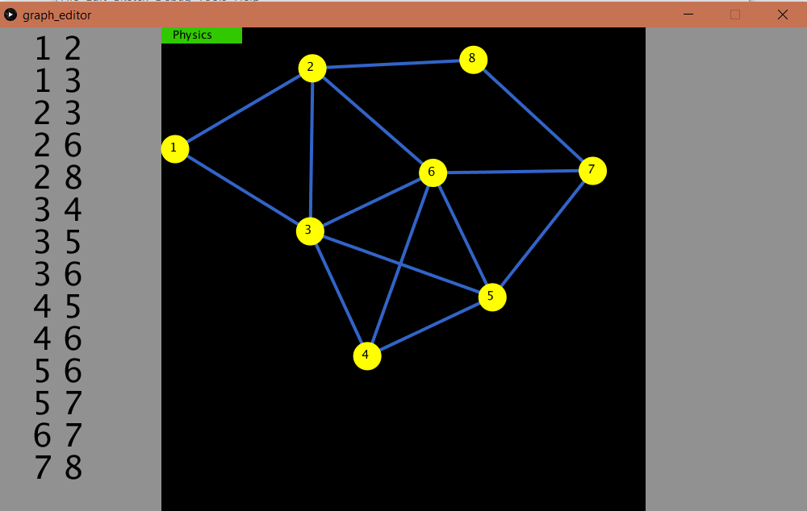

# GraphEditor
A graph editor in [Processing](https://processing.org/) with some visual algorithms and physical movement (attraction/repulsion).

## Example

## Usage

1. Use right button to add notes.
2. Use left button to connect them.
3. To delete a node hit `DEL` and an active (circled red) node will be gone.
4. Trying to connect two nodes that are already connected will lead to deletion of an edge.
5. Hit `e` for the Eulerian path animation to start (if there is no Eulerian path, the screen will flash red). You can read more on the Eulerian path [here](https://en.wikipedia.org/wiki/Eulerian_path).
6. You can press the `Physics` button to turn physics on and off.

Note: Look out for the active node in order to prevent connecting something accidentally.

## Inspiration

Inspired by CSAcademy's [graph editor](https://csacademy.com/app/graph_editor/).
